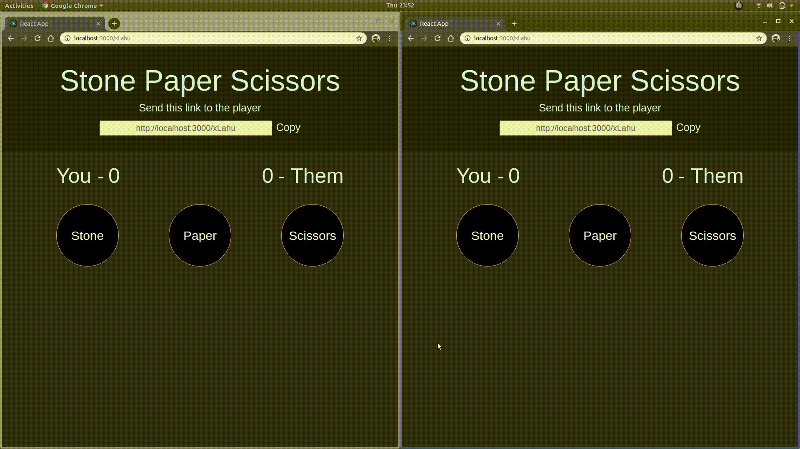

# Stone Paper Scissors Game

A simple Stone Paper Scissors game where you pass the generated link to the other player you wish to play with. It uses client to client connection protocol which uses websockets.

## Technologies Used  

1) React (For frontend)
2) Socket (socket.io) (For establishing connection between clients) 
3) Express (For setting up server)

Deployed at [link](http://sps-game.com.s3-website-us-east-1.amazonaws.com/QT1p0) and [API](https://mysterious-beyond-36405.herokuapp.com/)
